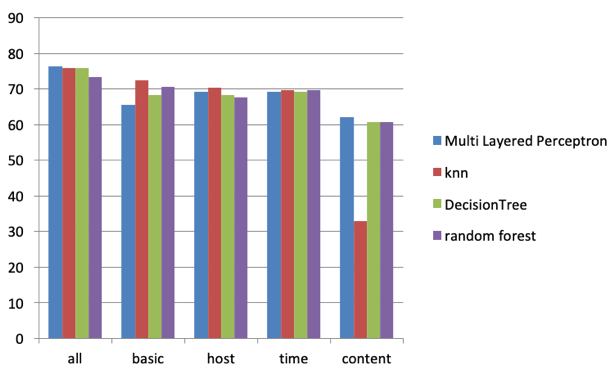

# Network-Intrusion-Detection-Using-Deep-Learning

Binary and Multi-Class Classification of NSL-KDD dataset using Multi Layered Perceptron(MLP).

#  Basic modules:

Data Pre-processing:
  The preprocessing of dataset consists of data Numeralization and Normalization of the original data, which are described below.

Numeralization:
There are total 38 numeric features and 3 nonnumeric features in the NSL-KDD dataset. As the Deep Neural Network model takes only numeric value, so we have to convert the non-numeric features into numeric form[5]. In NSL-KDD dataset, some non-numeric features are ‘protocol-type’, ‘service’, ‘flag’. These symbolic features include the type of protocol (i.e., TCP, UDP and ICMP), service type (e.g., HTTP, FTP, Telnet and so on) and TCP status flag (e.g., SF, REJ and so on). The method simply replaces the values of the categorical attributes with numeric values as shown in table below.
  

Normalization:
The second part is normalization. Since the difference between the maximum and minimum values of some attributes has a very large scope, so these values will be normalized between range [0-1] by using equation-1. Where MAX and MIN are the maximum and minimum values respectively.
  

Training and Testing:
After the pre-processing of dataset is done, the training dataset will be used to train using MLP, KNN, Descision Tree Classifier and Random forest Classifier.

Testing Approaches:
The test datasets were fed to the trained model to predict the attack classes both for ‘Binary Classification’ and ‘Multi Class Classification’. Using the model’s prediction and the confusion matrix test results were created using ‘train-test’ accuracy graphs and histograms. The role of confusion matrix[3] for determining the accuracy of binary and multiclass classification results is described below.

Confusion Matrix:
In our model, the most important performance indicator (Accuracy) of intrusion detection is used to measure the performance of the RNN-IDS model. In addition to the accuracy, we introduce the detection rate and false positive rate. The True Positive (TP) is equivalent to those correctly rejected, and it denotes the number of anomaly records that are identified as anomaly. 

The False Positive (FP) is the equivalent of incorrectly rejected, and it denotes the number of normal records that are identified as anomaly. The True Negative (TN) is equivalent to those correctly admitted, and it denotes the number of normal records that are identified as normal. The False Negative (FN) is equivalent to those incorrectly admitted, and it denotes the number of anomaly records that are identified as normal. Table-5.2 shows the definition of confusion matrix. We have the following notation:

Accuracy: 
The percentage of the number of records classified correctly versus total the records shown in equation below.

True Positive Rate (TPR): As the equivalent of the Detection Rate (DR), it shows the percentage of the number of records identified correctly over the total number of anomaly records, as shown in equation below.

False Positive Rate (FPR): The percentage of the number of records rejected incorrectly is divided by the total number of normal records, as shown in equation below.

Hence, the motivation for the IDS is to obtain a higher accuracy and detection rate with a lower false positive rate.

Test Reports:

In binary classification, the accuracy table below shows that basic feature produces the least accuracy for all classifiers. In ‘basic’, ‘host based’ and ‘all’ features, the MLP model shows better accuracy. The accuracy results are non-deterministic in nature because for some feature, one classifier works better and for other features some other classifier produces better results. Although the KNN took substantial amount of time in both training and testing process. In binary classification, most of the accuracy results of the classical machine learning classifiers that are used in this project have produced very close results to the MLP classifier.

Histogram comparison of different classifiers in binary classification.

In multi class classification, the accuracy table shows that content related feature produces the least accuracy for all classifiers. In ‘all’ and ‘content related’ features the MLP model shows better accuracy. The multi class classification accuracy shows non-deterministic results similar to the binary classification; because for some feature, one classifier works better and for other features some other classifier produces better results. Here also, the KNN took substantial amount of time in both training and testing process. In multi class classification, the results of the classical machine learning algorithms and MLP were very close, which is similar to the binary classification results.

Histogram comparison of different classifiers in multiclass classification.

References:
[1] http://nsl.cs.unb.ca/NSL-KDD/, Last accessed October 2019.

[2] L.Dhanabal, Dr. S.P. Shantharajah, “A Study on NSL-KDD Dataset for Intrusion Detection System Based on Classification Algorithms”, International Journal of Advanced Research in Computer and Communication Engineering,Vol. 4, Issue 6, June 2015.

[3] Chuanlong yin , Yuefei zhu, Jinlong fei, and Xinzheng he. “A Deep Learning Approach for Intrusion Detection Using Recurrent Neural Networks”,IEEE Access, date of publication October 12, 2017.

[4] J. Schmidhuber, “Deep learning in neural networks: An overview,”Neural Netw., vol. 61, pp. 85_117, Jan. 2015.

[5] Gael Kamdem De Teyou , Junior Ziazet “Convolutional Neural Network for Intrusion Detection System In Cyber Physical Systems”, https://www.researchgate.net/publication/333022621, May 2019.
